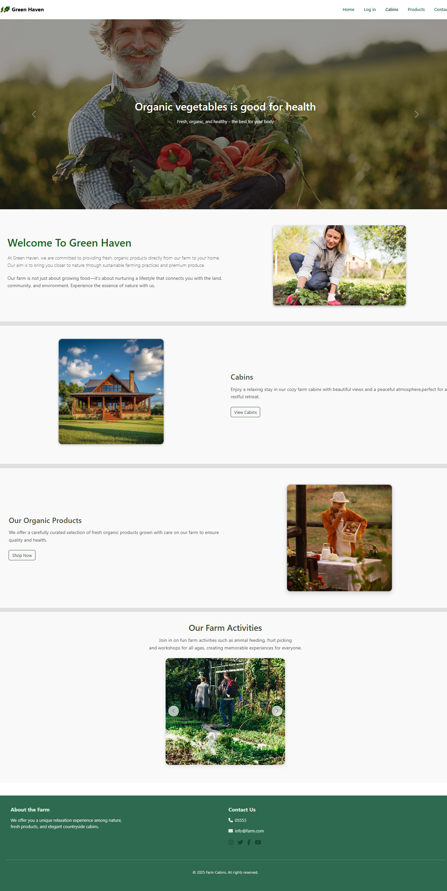
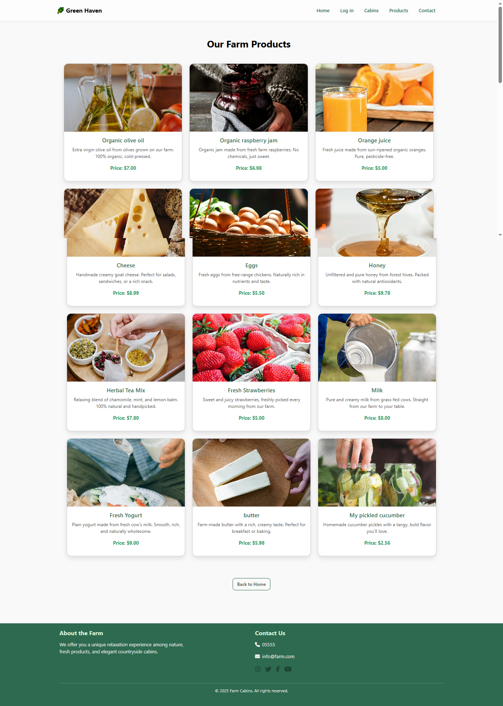
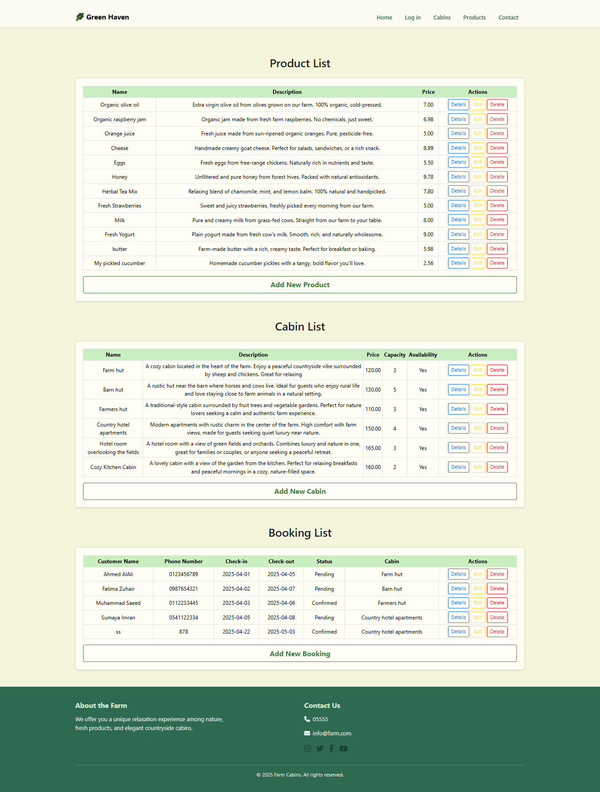

## 🌿 Farm Management System (ASP.NET Core MVC)

A web-based farm management system developed using **ASP.NET Core MVC**, designed to provide users with an interactive experience to explore farm cabins and organic products, while offering administrators full control through a dedicated dashboard.

This project focuses on simplifying farm tourism management and organizing organic product offerings within a clean and user-friendly interface.

---

## ⭐ Project Highlights

* Designed and developed a full-stack web application using ASP.NET Core MVC
* Streamlined farm operations by developing a centralized Admin Dashboard, reducing manual booking management effort.
* Applied CRUD operations across multiple entities with Entity Framework Core
* Structured a clean and maintainable MVC architecture
* Built a responsive and user-friendly interface using Bootstrap
* Integrated dynamic UI components using JavaScript and Swiper.js

---

## 🚀 Key Features

### 👤 User Side

* View the farm homepage
* Browse available cabins
* Explore farm activities
* Discover organic products
* Access general information about the farm

### 🛠️ Admin Dashboard

* Secure admin login
* Full product management (Create / Read / Update / Delete)
* Cabin management (Create / Read / Update / Delete)
* Booking management (Create / Read / Update / Delete)
* Image upload support for cabins and products

---

## 🧰 Tech Stack

### 🔹 Backend

* ASP.NET Core MVC (.NET 6)
* C#
* Entity Framework Core
* SQL Server

### 🔹 Frontend

* Razor Views
* HTML5 & CSS3
* Bootstrap
* JavaScript
* Swiper.js

---

## 🖼 Image Handling

All images related to cabins and products are stored in:

```id="c6v1kx"
wwwroot/images
```

---

## ⚙️ Getting Started

1. Clone the repository:

```id="n2f9qe"
git clone https://github.com/RzanDav/FarmManagement.git
```

2. Open the project in **Visual Studio 2022**

3. Update the database connection string in:

```id="h7w4ms"
FarmBookingDBContext.cs
```

```id="g5x8pl"
Server=.;Database=FarmBookingDB;Trusted_Connection=True;
```

4. Run the application:

```id="u3z9bd"
Ctrl + F5
```

---

## 📈 Future Enhancements

* User registration and authentication system
* Password hashing for improved security
* Online booking and payment integration
* Email notification system

---

## 🖼 Screenshots

<p align="center">
  
  
</p>
<p align="center">
  <b>Homepage</b> &nbsp;&nbsp;&nbsp;&nbsp;&nbsp;&nbsp;&nbsp;&nbsp;&nbsp;&nbsp;&nbsp;&nbsp;&nbsp;&nbsp;&nbsp;&nbsp;&nbsp;&nbsp;&nbsp;&nbsp;&nbsp;&nbsp;&nbsp;&nbsp; <b>Cabins</b>
</p>

<p align="center">
  
  
</p>
<p align="center">
  <b>Products</b> &nbsp;&nbsp;&nbsp;&nbsp;&nbsp;&nbsp;&nbsp;&nbsp;&nbsp;&nbsp;&nbsp;&nbsp;&nbsp;&nbsp;&nbsp;&nbsp;&nbsp;&nbsp;&nbsp;&nbsp;&nbsp;&nbsp;&nbsp;&nbsp; <b>Admin Dashboard</b>
</p>
