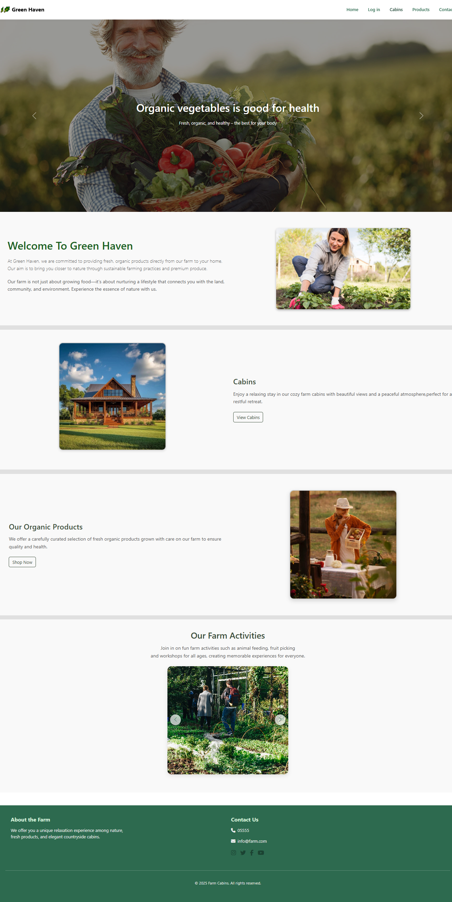
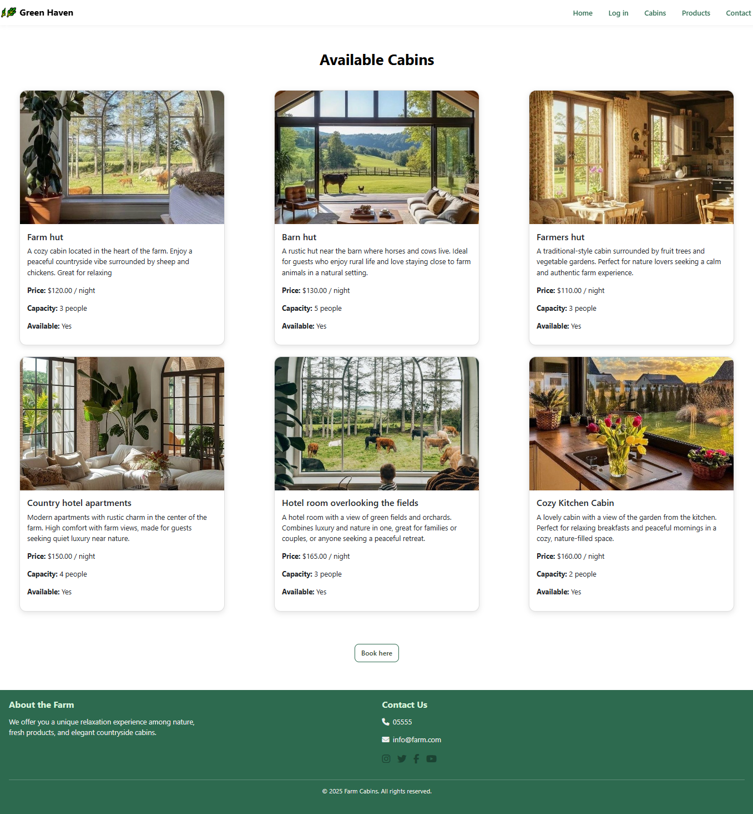
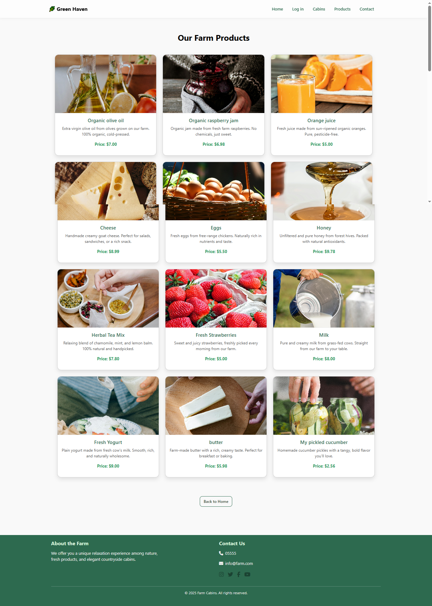
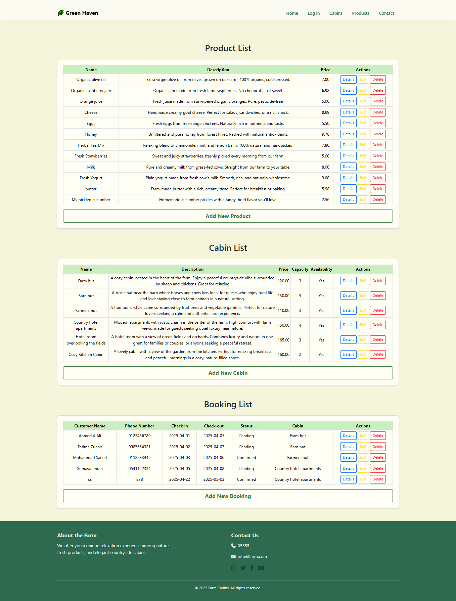

# 🌿 Farm Management System (ASP.NET Core MVC)

A full-stack web application developed using **ASP.NET Core MVC**, designed to digitize farm-tourism operations. The platform offers visitors an interactive experience to explore cabins, activities, and organic products, backed by a robust database architecture and an administrative ecosystem for managing bookings and farm resources.

---

## ⭐ Key Highlights

* Designed and deployed a complete relational database structure in SQL Server using the **Database-First** approach.
* Integrated **Entity Framework Core** to scaffold entity models and manage data persistence efficiently via `DbContext`.
* Established complete CRUD operations across multiple entities (Cabins, Products, Bookings, Users).
* Structured a clean and maintainable MVC architecture separating data access from presentation logic.
* Built a responsive and user-friendly interface using **Bootstrap**, **Razor Views**, and **JavaScript / Swiper.js**.

---

## 🛠️ My Role & Core Contributions

While this project was a collaborative team effort, my primary focus and responsibility centered on the **Database Architecture, Data Modeling, and ORM Integration**:

* **Database Architecture & Design:** Designed and implemented the complete **SQL Server** relational database schema, enforcing referential integrity, foreign keys, and domain constraints.
* **ORM & Entity Framework Core Integration:** Successfully applied the **Database-First** approach by scaffolding entity models and generating the `FarmBookingDBContext` for efficient data querying via LINQ.
* **Database Provisioning & Environment Setup:** Configured initial seed data, connection strings (`appsettings.json`), and database setup scripts/backups (`script.sql` / `.bak`) for seamless environment setup.

---

## 🚀 Key Features

### 👤 User Portal

* **Farm Homepage:** View dynamic visual showcases and farm highlights using Swiper.js carousels.
* **Cabins Catalog:** Browse available cabins pulled dynamically from the database with capacity and pricing per night.
* **Organic Products:** Discover organic farm products with descriptions and pricing.
* **Activities & Info:** Explore farm experiences, events, and general visitor information.

### 🛠️ Admin Dashboard

* **Secure Admin Access:** Authentication system for authorized farm staff.
* **Full Entity Management (CRUD):** Complete control over Products, Cabins, and Bookings.
* **Image Handling:** Support for cabin and product image uploads stored under `wwwroot/images`.

---

## 🧰 Tech Stack

| Layer | Technologies Used |
| :--- | :--- |
| **Database & Data Layer** | Microsoft SQL Server, Entity Framework Core (Database-First), T-SQL |
| **Backend** | ASP.NET Core MVC (.NET 6), C# |
| **Frontend** | Razor Views, HTML5, CSS3, Bootstrap, JavaScript, Swiper.js |
| **Tooling** | Visual Studio 2022, SQL Server Management Studio (SSMS), Git |

---

## 🗄️ Database Architecture

The system relies on a relational database schema (**FarmBookingDB**) engineered with key validation constraints:

* **Cabins:** `Id` (PK), `Name`, `Description`, `ImageUrl`, `PricePerNight` (≥ 0), `Capacity` (> 0), `IsAvailable`.
* **Products:** `Id` (PK), `Name`, `Description`, `ImageUrl`, `Price` (≥ 0).
* **Bookings:** `Id` (PK), `CabinId` (FK → Cabins.Id), `CustomerName`, `PhoneNumber`, `CheckInDate`, `CheckOutDate` (> CheckInDate), `Status` (*Pending / Confirmed / Cancelled*).
* **Users:** `Id`, `Username` (Unique), `PasswordHash`, `Role`.

---

## ⚙️ Getting Started

### Prerequisites
* **Visual Studio 2022** (with ASP.NET and web development workload)
* **.NET 6 SDK**
* **Microsoft SQL Server** (LocalDB, Express, or SSMS)


### Setup Steps

* **Step 1: Clone the Repository**
  Execute the following command in your terminal:
  ```bash
  git clone [https://github.com/RzanBash/FarmManagement.git](https://github.com/RzanBash/FarmManagement.git)

```

* **Step 2: Database Provisioning**
Import and execute the `script.sql` file (or restore the `.bak` database backup) using **SQL Server Management Studio (SSMS)** to instantiate the `FarmBookingDB` schema along with initial seed data.
```
* **Step 3: Configure Connection String**
Modify the database connection string in `appsettings.json` (or `FarmBookingDBContext.cs`) to point to your local SQL Server instance:
```json
"ConnectionStrings": {
  "DefaultConnection": "Server=.;Database=FarmBookingDB;Trusted_Connection=True;TrustServerCertificate=True;"
}

```


* **Step 4: Launch the Application**
Open `FarmManagement.sln` using **Visual Studio 2022** and press `Ctrl + F5` to compile and run the project.

```


```
---

## 📈 Future Enhancements

* Password hashing implementation for improved security.
* Enforcing role-based authorization attributes on administrative routes.
* Online booking and payment integration.
* Email/SMS notification system for reservation updates.

---

## 🖼️ Screenshots

| Homepage | Cabins Page |
| :---: | :---: |
|  |  |

| Products Page | Admin Dashboard |
| :---: | :---: |
|  |  |
